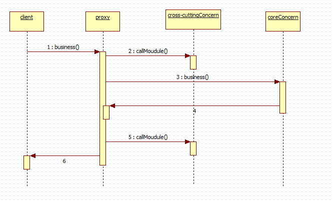

# AOP(Aspect Oriented Programming)의 구현

### 개요 

- 트랜잭션이나 로깅, 보안과 같이 여러 모듈에서 공통적으로 사용하는 기능의 경우 해당 기능을 분리하여 관리할 수 있다.
  - Transaction : 데이터베이스의 상태를 변화시키기 위해 수행하는 작업단위
  - Logging : log를 생성하도록 시스템을 작성하는 것

- 공통모듈의 반복적 코드를 줄여줌

- 핵심 비지니스 로직에만 집중할 수 있는 방법을 제공
  - Business logic: 요청된 기능(문제)을 수행(해결)해주는 기능
  - Core concern: 핵심관심, 핵심 비지니스 기능
  - Cross-cutting concern: 횡단관심, 어플리케이션 전반에 걸쳐 적용되는 공통기능
  
- 은행업무기준
  - 횡단관심 = [로깅, 보안, 트랜젝션]
  - 핵심관심 = [계좌이체, 입출금, 이자계산]
  
  **<도식>**
  
  
  
- AOP에서는 공통관심을 하나의 클래스 단위(aspect)로 분리하여 재사용성과 유지보수성을 높임

- AOP 적용시 구현클래스에서 공통모듈 사용코드를 포함 하지 않음

- AOP 적용시 핵심로직을 구현한 클래는 더 이상 여러 공통모듈을 의존하지 않음

### 용어

**< AOP구조도 >**

- **Join Points**

  - Join Points는 클라이언트가 호출하는 모든 비즈니스 메소드

    ex) BbsService, MemberService 클래스의 모든 메소드를 말한다.

  - 포인트컷 대상, 포인트컷 후보라고 하며, Join Points중에서 포인트컷이 선택됨

- **Pointcut**

  - 필터링된 조인포인트

  - 트랜잭션처리 하는 공통기능을 만들었을 때

    - 횡단관심은 등록, 수정, 삭제 기능의 비즈니스 메소드에 대해서는 동작
    - 검색 기능의 메소드에서는 트랜잭션과 무관하여 동작할 필요가 없음

  - 수많은 비즈니스 메소드 중, 원하는 특정 메소드에서만 횡단관심에 해당하는 공통기능을 수행을 위해 포인트컷이 필요

  - 포인트컷을 이용하면 메소드가 포함된 클래스의 패키지, 메소드 시그니처까지 정확하게 지정가능

  - expression 값을 설정하는 방법에 따라 필터링되는 메소드가 달라짐 

    - ex) `execution(* spring.model.bbs.*Service.*(..))` 

      |    *     | spring.modal.bbs. | *Service. |        *(..)         |
      | :------: | :---------------: | :-------: | :------------------: |
      | 리턴타입 |    패키지경로     | 클래스명  | 메소드명 및 매개변수 |

- **Advice**
  
  - Advise 는 횡단관심에 해당하는 공통 기능의 코드를 의미
  - 독립된 클래스의 메소드로 작성
  - Advise 의 메소드가 언제 동작할지는 스프링 설정파일을 통해서 지정

- **Weaving**
  - 포인트컷으로 지정한 핵심관심 메소드가 호출될때, 어드바이스에 해당하는
      횡단관심 메소드가 삽입되는 과정을 의미
  - Weaving을 통해서 비즈니스 메소드를 수정하지 않고도 횡단관심에 해당하는
      기능을 추가/변경 가능
  - Weaving 처리방식은 Compiletime Weaving, Loadingtime Weaving, Runtime Weaving이 있음
  - 스프링에서는 Runtime Weaving 방식을 지원

- **Aspect** 또는 **Advisor**
  - Aspect는 포인트컷과 어드바이스의 결합(Aspect는 AOP의 핵심)
  - 어떤 포인트컷 메소드에 대해 어떤 어드바이스 메소드를 실행할지를 결정
  - 이 Aspect의 설정에 따라 AOP의 동작방식이 결정됨

- **Proxy** 

  - 위빙될때 생성되는 객체

  - Spring AOP의 동작을 전반적으로 제어 하는 객체  

    **< 프록시 호출 구조 >**

  

### Spring의 AOP

- Spring에서  AOP는 **런타임시에  AOP를 적용**하므로 소스코드나 클래스 정보를 변경 하지 않음
- Spring에서  AOP는 **프록시를 이용하여  AOP를 적용함**
- 프록시 기반  AOP는 핵심로직을 구현한  객체에 직접 접근하는 것이 아님
- 중간에 프록시를 생성하여 프록시를 통해서 핵심로직을 구현한 객체에 접근함(프록시 호출 이미지 참조)
- 프록시 기반에서는 **메서드 호출때에만 Advice를 적용**할 수 있음
- 필드값 변경과 같은 Joinpoint에 대해서는 적용할 수 없음

