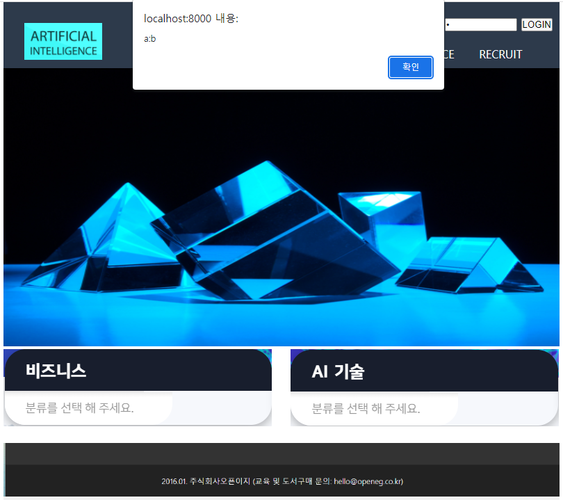
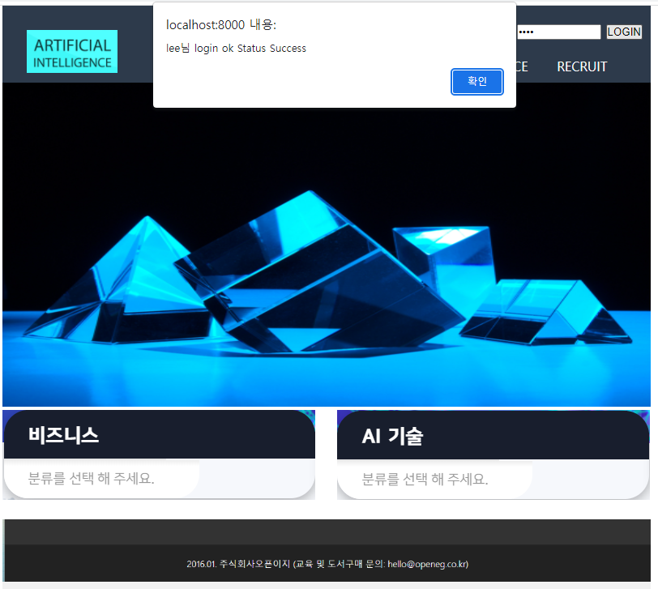

# 실습과제

### 01. Spring boot 프로젝트를 사용하여 id에 a를, pw에 b를 입력하여 로그인 버튼을 눌렀을 때 다음과 같은 alert창이 뜨도록 test.js 작성

### 02. 01의 확인 버튼을 누르면 AJEX get형식의 login 요청이 처리되어 다음과 같이 새로운 alert 응답을 하는 UserController.java를 작성

**< 조건 >**

- js/test.js에서 비동기 get요청을 fetch를 사용하여 처리
- UserController -> UserService -> UserMapper  -> user.xml (mybatis) 를 완성하여 사용
- 로그인 id와 passwd가 user테이블에 존재하면 회원 이름 "님 login ok Stus Success"를 출력
- webtest 의 user 테이블을 아래와 같이 직접 만들어서 사용

| 필드명 | 데이터타입  | 제약조건    | 의미     | 비고           |
| ------ | ----------- | ----------- | -------- | -------------- |
| id     | varchar(8)  | primary key | 아이디   | 테이블명: user |
| passwd | varchar(8)  | not null    | 비밀번호 | 테이블명: user |
| name   | carchar(20) | not null    | 회원이름 | 테이블명: user |

- 테이블에 3개의 레코드입력
  - 레코드1, admin, 1234, kim
  - 레코드2, user, 1234, lee
  - 레코드3, tester, 1234, park

### <원본 파일은 original/AI_web_test2로 올렸으며 문제를 풀게되면 md파일로 수정부부만 올림>

